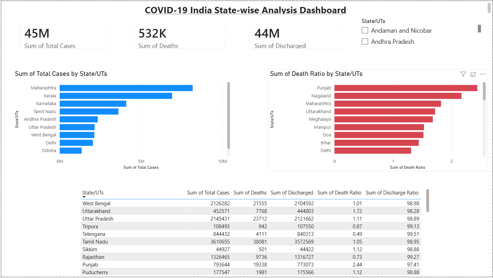

# 🦠 COVID-19 India State-wise Analysis

## 📌 Project Overview
Exploratory Data Analysis of COVID-19 across 36 Indian states 
and Union Territories using Python and Power BI.

## 🛠️ Tools Used
- Python (pandas, numpy, matplotlib, seaborn, plotly)
- Google Colab
- Power BI Desktop
- SQL
- GitHub

## 📊 Dashboard Preview


## 🔍 Key Findings
- **Maharashtra** had the highest cases (81.7L) and deaths (1.48L)
- **Punjab** had the highest Death Ratio at 2.44% despite fewer total cases
- **All 36 states** achieved above 97% discharge (recovery) rate
- **Population size** had no correlation with case count (r = -0.07)
- **Punjab** had 1,233 active cases — 6x more than Maharashtra in 2nd place

## 📁 Project Structure

```
covid19-india-eda/
│
├── Covid19_India_EDA.ipynb         # Main analysis notebook
├── covid_sql_analysis.sql          # 10 SQL queries for business insights
├── covid19_india_cleaned.csv       # Cleaned dataset
├── COVID19_India_Dashboard.pbix    # Power BI dashboard
├── COVID19_Dashboard.png           # Dashboard screenshot
└── README.md
```
## ⚠️ Data Limitations
- Snapshot dataset — wave-wise trend analysis not possible
- Population column had inconsistent values — documented in notebook

## 👩‍💻 Author
Rekha Shida | Computer Engineering | Parul University  
GitHub: github.com/rekhashida  
LinkedIn: linkedin.com/in/rekha-sida-rs576
